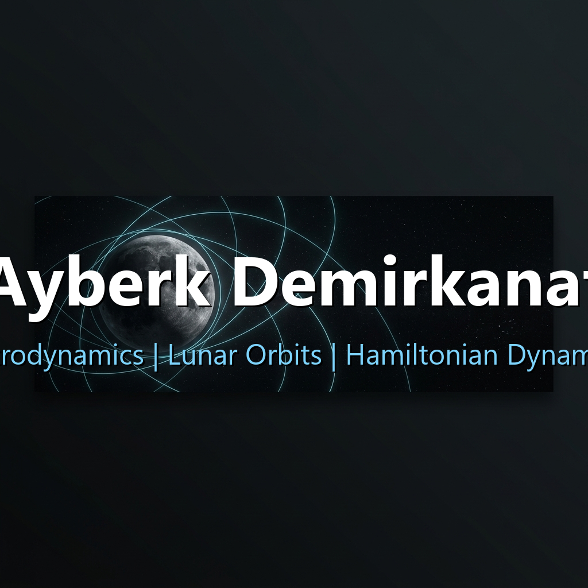
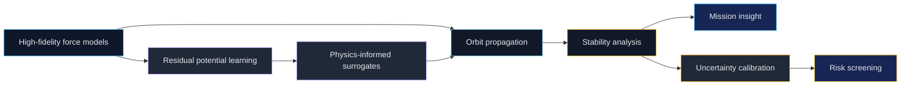

  

    

  

    

  
  
  
  

---

## Mission Brief

I am a senior Astronautical Engineering student at Istanbul Technical University, focused on long-term orbit propagation, lunar orbit stability, high-fidelity force modeling, and machine-learning-assisted numerical tools.

My work lives at the intersection of classical astrodynamics and modern research engineering: build physically honest models, make them computationally useful, then turn the results into insight.

<table>
  <tr>
    <td width="50%">
      <h3>Current Coordinates</h3>
      <ul>
        <li><b>University:</b> Istanbul Technical University</li>
        <li><b>Track:</b> Astronautical Engineering</li>
        <li><b>GPA:</b> 3.78 / 4.00</li>
        <li><b>Focus:</b> Lunar dynamics, orbit propagation, uncertainty analysis</li>
      </ul>
    </td>
    <td width="50%">
      <h3>Research Vector</h3>
      <ul>
        <li>Structure-preserving and high-order numerical integration</li>
        <li>Physics-informed ML and Sobolev-trained surrogates</li>
        <li>Monte Carlo stability workflows and trajectory risk screening</li>
        <li>Scientific Python tooling for aerospace analysis</li>
      </ul>
    </td>
  </tr>
</table>

## Research Operating System

## Featured Missions

<table>
  <tr>
    <td width="50%">
      <h3><a href="https://github.com/ayberkdt/lunaris">Lunaris</a></h3>
      
<b>Lunar gravity modeling and orbit propagation framework</b>

      
Implements a Sobolev-Trained Lunar Residual Potential Surrogate over lower-degree spherical harmonics to accelerate propagation while preserving physical structure.

      

        
        
        
      

    </td>
    <td width="50%">
      <h3><a href="https://github.com/ayberkdt/vesp-uq">VESP-UQ</a></h3>
      
<b>Uncertainty calibration and trajectory risk screening</b>

      
Research tooling for surrogate-agnostic uncertainty workflows, interior equivalent sources, and long-horizon orbital risk analysis.

      

        
        
        
      

    </td>
  </tr>
  <tr>
    <td width="50%">
      <h3><a href="https://github.com/ayberkdt/Satellite-Anomaly-Knowladge">Satellite Anomaly Knowledge</a></h3>
      
<b>Aerospace anomaly knowledge base</b>

      
Collects and structures satellite anomaly data for aerospace analysis, documentation, and future decision-support workflows.

      

        
        
      

    </td>
    <td width="50%">
      <h3><a href="https://github.com/ayberkdt/universite_listeleme_uygulamasi">UniRank</a></h3>
      
<b>University search, filtering, and comparison tool</b>

      
A practical data application for querying and comparing university options with academic and structural filters.

      

        
        
      

    </td>
  </tr>
</table>

  
<b>More mission hardware</b>

   
  <ul>
    <li><b>YOLOv8-CSRT:</b> Object detection and tracking experiments for UAV-oriented workflows.</li>
    <li><b>ihaYOLO:</b> Computer-vision tooling tailored for unmanned aerial vehicle scenarios.</li>
  </ul>

## Engineering Stack

  
    
  
  
  
  
  

## GitHub Telemetry

  
  
   
  

  

  

## Open Channels

I am interested in research engineering, astrodynamics simulation, machine-learning-assisted orbital analysis, and aerospace software that turns complex dynamics into usable tools.

  
  

