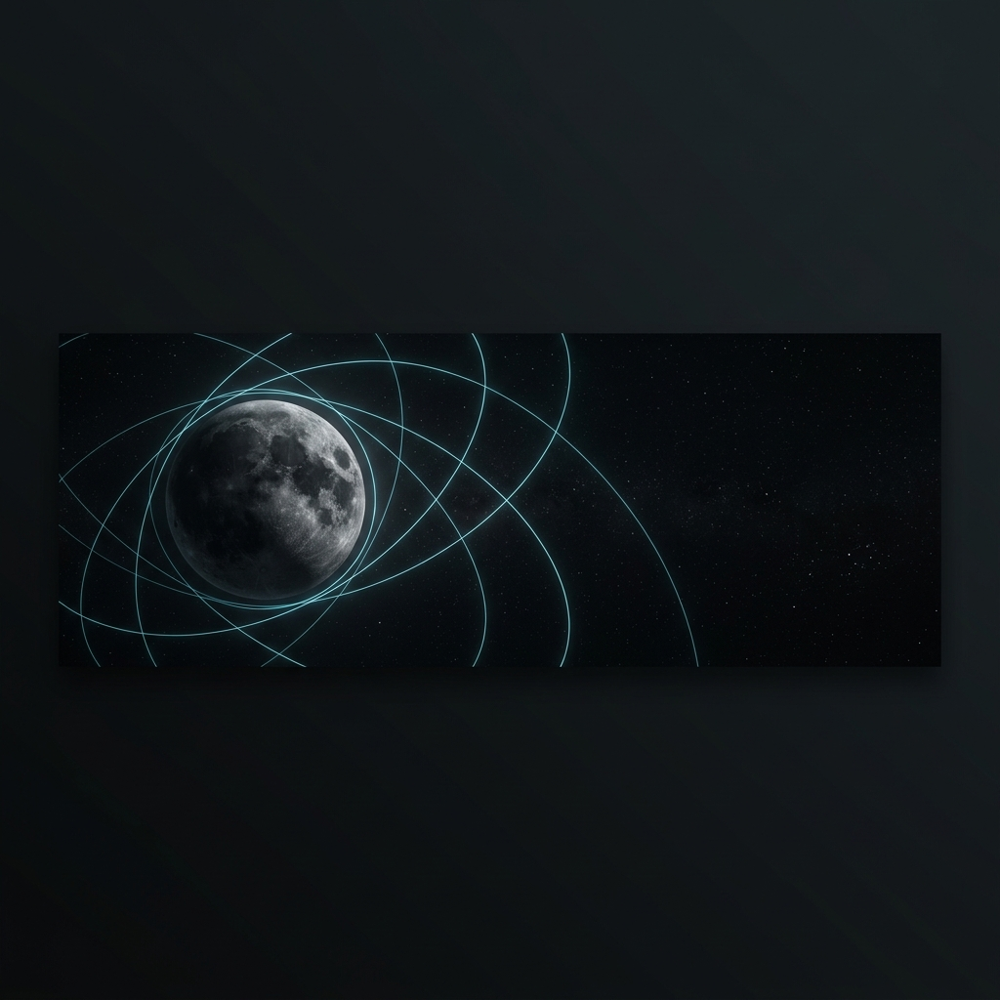

  
  
    
  
  <h1>Ayberk Demirkanat</h1>
  
  
   
  
  
  

 

> **Profile:** Senior Astronautical Engineering student at Istanbul Technical University (ITU) specializing in astrodynamics, numerical analysis, and machine learning. My work focuses on developing numerical tools for long-term orbit propagation and analyzing lunar orbit stability, with a strong emphasis on the intersection of classical orbital mechanics and artificial intelligence.

 

## 🎯 Core Competencies

- 🪐 **Astrodynamics:** High-fidelity force modeling • Orbital perturbations • Low-Energy Transfers
- 🧮 **Numerical Methods:** Structure-preserving integration • DOP853 • Hamiltonian Dynamics
- 🧠 **Machine Learning:** Physics-informed ML • Sobolev Training • Computer Vision

 

## 🔬 Main Research Projects

### [Lunaris: Lunar Gravity Modeling & Orbit Propagation](https://github.com/ayberkdt/lunaris)

**Lunaris** is a lunar gravity modeling and orbit propagation framework that implements a Sobolev-Trained Lunar Residual Potential Surrogate (ST-LRPS). The project investigates learning a residual scalar potential over a lower-degree spherical-harmonic baseline to improve computational efficiency in orbit propagation tasks while preserving physical accuracy.
- **ST-LRPS Surrogate Model:** A neural network architecture trained using Sobolev methods to infer residual potentials and gravitational gradients.
- **Physics Engine:** Integrates adaptive spherical-harmonic gravity (up to 1800x1800 via GL1800F), solar radiation pressure, Albedo effects, and third-body perturbations using NAIF SPICE kernels.
- **Analysis Pipeline:** Includes Monte Carlo workflows for stability analysis and post-processing tools.

---

### [VESP-UQ: Uncertainty Calibration & Trajectory Risk Screening](https://github.com/ayberkdt/vesp-uq)

**VESP-UQ** is a research-oriented project focusing on surrogate-agnostic uncertainty calibration and trajectory risk screening. The methodology utilizes interior equivalent sources to efficiently map state uncertainties and evaluate long-term orbital risks.

---

### [Satellite Anomaly Knowledge (SAK)](https://github.com/ayberkdt/Satellite-Anomaly-Knowladge)

A repository dedicated to gathering, analyzing, and documenting satellite anomaly data and knowledge bases for aerospace applications.

 

## 🛠️ Hobby & Side Projects

### [UniRank (Üniversite Listeleme Uygulaması)](https://github.com/ayberkdt/universite_listeleme_uygulamasi)
A software tool developed to query, compare, and filter university data based on user-defined academic and structural criteria.

### YOLOv8-CSRT / ihaYOLO
Implementations of object detection and tracking algorithms using YOLOv8 and CSRT, specifically tailored for Unmanned Aerial Vehicle (UAV) systems.

 

## ⚙️ Tech Stack & GitHub Stats

  
  
  
  
  
   <!-- Spacer -->
  

 

  

