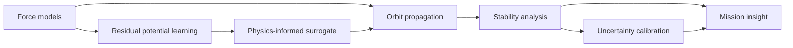

  

  

    

  
  
  

---

## Mission Brief

I build research-oriented aerospace software around orbit propagation, lunar dynamics, numerical analysis, and machine-learning-assisted modeling.

The main thread in my work is simple: start from physically meaningful models, make them computationally useful, and turn complex orbital behavior into readable engineering insight.

<table>
  <tr>
    <td width="33%">
      <h3>Orbit Dynamics</h3>
      
Long-term propagation, lunar orbit stability, perturbation modeling, and low-energy trajectory analysis.

    </td>
    <td width="33%">
      <h3>Numerical Engines</h3>
      
High-order integration, Hamiltonian structure, Monte Carlo pipelines, and scientific Python tooling.

    </td>
    <td width="33%">
      <h3>Physics-Informed AI</h3>
      
Sobolev-trained surrogates, residual potential learning, uncertainty calibration, and risk screening.

    </td>
  </tr>
</table>

## Research Flow

## Featured Work

<table>
  <tr>
    <td width="50%">
      <h3><a href="https://github.com/ayberkdt/lunaris">Lunaris</a></h3>
      
<b>Lunar gravity modeling and orbit propagation framework.</b>

      
Explores Sobolev-Trained Lunar Residual Potential Surrogates over spherical-harmonic baselines for faster, physically grounded propagation.

      

        
        
        
      

    </td>
    <td width="50%">
      <h3><a href="https://github.com/ayberkdt/vesp-uq">VESP-UQ</a></h3>
      
<b>Uncertainty calibration and trajectory risk screening.</b>

      
Research tooling for surrogate-agnostic uncertainty workflows, interior equivalent sources, and long-horizon orbital risk analysis.

      

        
        
        
      

    </td>
  </tr>
  <tr>
    <td width="50%">
      <h3><a href="https://github.com/ayberkdt/Satellite-Anomaly-Knowladge">Satellite Anomaly Knowledge</a></h3>
      
<b>Aerospace anomaly knowledge base.</b>

      
Collects and organizes satellite anomaly knowledge for aerospace analysis and future decision-support workflows.

      

        
        
      

    </td>
    <td width="50%">
      <h3><a href="https://github.com/ayberkdt/universite_listeleme_uygulamasi">UniRank</a></h3>
      
<b>University filtering and comparison application.</b>

      
A practical data tool for querying, filtering, and comparing university options through academic and structural criteria.

      

        
        
      

    </td>
  </tr>
</table>

## Engineering Stack

  
    
  
  
  
  
  

## Public GitHub Snapshot

  
  

## Contact

  
  

