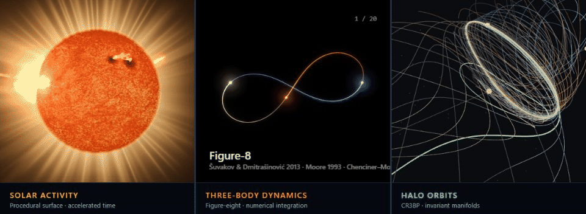

  

  
<b>Astronautical Engineering · Istanbul Technical University</b>

  

    <a href="https://ayberkdemirkanat.vercel.app"><b>Personal website</b></a> ·
    <a href="https://tr.linkedin.com/in/ayberk-demirkanat-68901722a">LinkedIn</a> ·
    <a href="mailto:ayberkdemirkanat@gmail.com">Email</a>
  

  

    <a href="#research-and-technical-work">Research</a> ·
    <a href="#sunumatik">Sunumatik</a> ·
    <a href="#other-projects">Other projects</a> ·
    <a href="#technical-skills">Technical skills</a>
  

I'm an Astronautical Engineering student at Istanbul Technical University. I work on lunar orbit propagation, gravity modeling, and numerical methods, and develop the software used in my research.

## Research and technical work

### [Lunaris](https://github.com/ayberkdt/lunaris)

*Lunar orbit propagation and gravity modeling*

- Python framework with spherical-harmonic gravity, configurable force models, ensemble analysis, and a PySide6 desktop interface.
- Includes ST-LRPS, an experimental neural model that learns a residual scalar potential above a lower-degree harmonic baseline, with training and validation tools.

**Python · NumPy · SciPy · SPICE · PyTorch · PySide6** · [Project showcase](https://lunaris-showcase.vercel.app)

### [Lunar gravity: force–trajectory gap](https://github.com/ayberkdt/lunar-gravity-force-trajectory-gap)

*Numerical error analysis and reproducibility*

- Study of gravity-force and trajectory errors under a fixed spherical-harmonic evaluation budget, using the degree-1800 GRAIL JGGRX_1800F field.
- Public archive of experiment configurations, campaign records, and verification scripts. The study examines cases where reducing force error increases trajectory error.

### [VESP-UQ](https://github.com/ayberkdt/vesp-uq)

*Uncertainty quantification for gravity surrogates*

- Equivalent-source model for uncertainty in surrogate acceleration errors, using a linear-Gaussian posterior and held-out calibration.
- Force-risk and out-of-distribution screening to identify trajectories for further high-fidelity analysis.

### [Oracle Adaptive](https://github.com/ayberkdt/oracle-adaptive)

*Adaptive gravity-model fidelity · research in progress*

- Research on selecting spherical-harmonic degree using orbital sensitivity, force-error direction, orbital phase, and remaining flight time.
- Follows the force–trajectory gap study, with the aim of allocating computation according to its effect on the trajectory.

### Additional engineering projects

| Project | Work |
| :--- | :--- |
| [Satellite Link Budget](https://github.com/ayberkdt/link_budget_analysis) | GEO link-budget analysis with atmospheric propagation, interference modeling, Monte Carlo availability, and DVB-S2 adaptive coding and modulation. |
| [YOLOv8 + CSRT](https://github.com/ayberkdt/YOLOv8-CSRT) | Object detection and tracking using YOLOv8 and the CSRT tracker. |
| [Satellite Anomaly Knowledge](https://github.com/ayberkdt/Satellite-Anomaly-Knowladge) | Collection and organization of satellite anomaly information. |

## Sunumatik

I built **[Sunumatik](https://github.com/ayberkdt/sunumatik)** for scientific presentations. It includes WebGL celestial scenes, numerical simulations, astrodynamics and GNC laboratories, and a chart engine. The scenes use HTML, CSS, JavaScript, and bundled Three.js.

  
   Recorded from the Sunumatik scenes. Solar time is accelerated.

The library covers three-body dynamics, halo orbits, atmospheric reentry, Lambert transfers, gravity assists, and orbit determination. It runs on a local static server and supports deterministic frame exports.

[Repository and gallery](https://github.com/ayberkdt/sunumatik#laboratuvar-galerisi) · [Setup](https://github.com/ayberkdt/sunumatik#hızlı-başlangıç) · [Static preview](./assets/sunumatik/science-in-motion-poster.png)

## Other projects

| Project | Work |
| :--- | :--- |
| [Metinoskop](https://github.com/ayberkdt/metinoskop) | Turkish editing skill for removing repetitive phrasing and filler while retaining meaning, facts, and the author's tone. Includes examples and evaluation cases. |
| [UniRank](https://github.com/ayberkdt/UniRank) | University search and comparison application built with FastAPI and vanilla JavaScript, with an aerospace and space master's finder. [Live application](https://uni-ranks.vercel.app) |

## Technical skills

| Area | Tools and methods |
| :--- | :--- |
| Scientific computing | Python, NumPy, SciPy, numerical integration, Monte Carlo analysis |
| Astrodynamics | Orbit propagation, spherical-harmonic gravity, NAIF SPICE |
| Machine learning and vision | PyTorch, OpenCV |
| Interfaces and visualization | PySide6 / Qt, JavaScript, Three.js, WebGL, SVG, HTML, CSS |
| Development | Git, GitHub Actions, Linux, FastAPI, Jupyter, LaTeX |

## GitHub activity

  
  

  Public data, updated daily. Language percentages are based on code bytes. <a href="./docs/profile-stats.md">Method and exclusions</a> · <a href="https://github.com/ayberkdt/ayberkdt/actions/workflows/update-profile-stats.yml">Update history</a>

## Contact

[ayberkdemirkanat.vercel.app](https://ayberkdemirkanat.vercel.app) · [LinkedIn](https://tr.linkedin.com/in/ayberk-demirkanat-68901722a) · [ayberkdemirkanat@gmail.com](mailto:ayberkdemirkanat@gmail.com)

