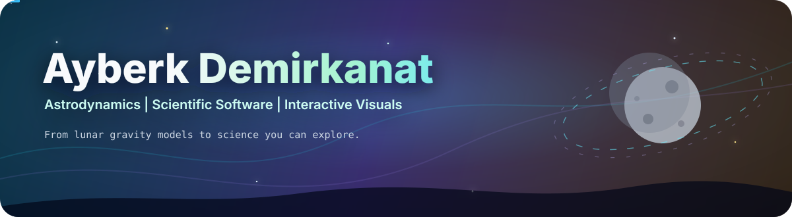
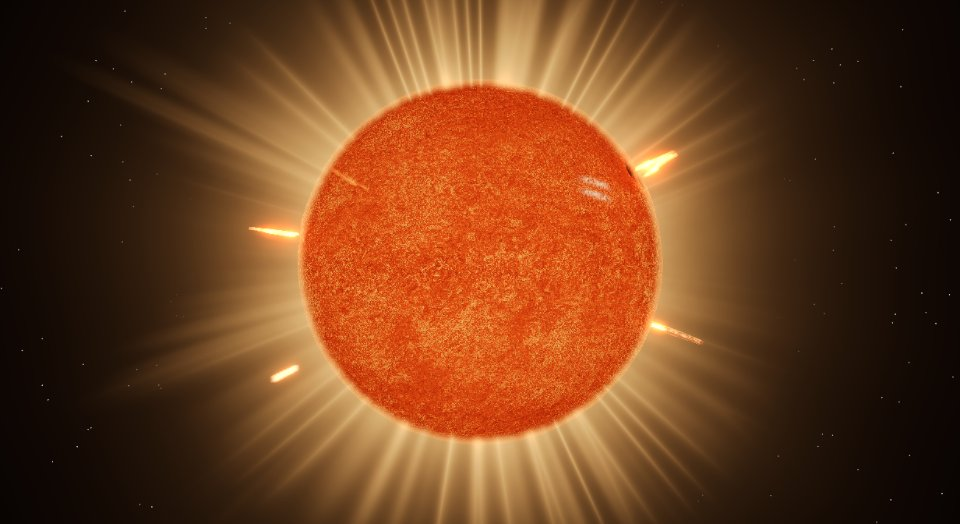
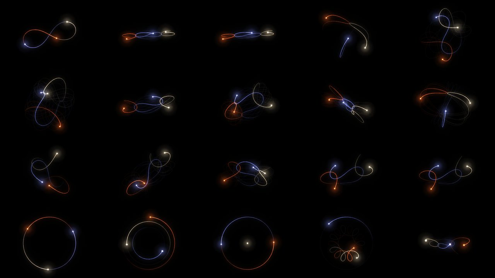
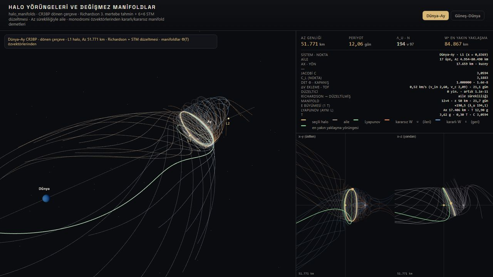
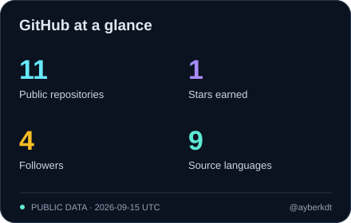
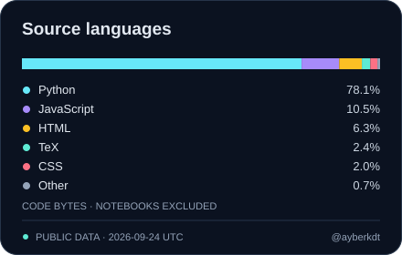
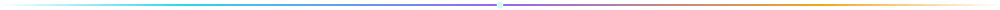

  

  
<b>Astronautical engineering student at Istanbul Technical University.</b> I build orbital models, research tools, and interactive ways to explain science.

  

    <a href="https://github.com/ayberkdt/sunumatik">Sunumatik</a> ·
    <a href="https://lunaris-showcase.vercel.app">Lunaris showcase</a> ·
    <a href="https://uni-ranks.vercel.app">Try UniRank</a> ·
    <a href="https://tr.linkedin.com/in/ayberk-demirkanat-68901722a">LinkedIn</a> ·
    <a href="mailto:ayberkdemirkanat@gmail.com">Email</a>
  

## What I build

My work starts with a physical model and ends with something people can inspect: an orbit, an experiment, a visual explanation, or a useful application. Most of it lives at the intersection of **astrodynamics, scientific computing, and visualization**.

- **Research software:** lunar gravity, orbit propagation, force-error calibration, and reproducible numerical experiments.
- **Interactive science:** WebGL scenes, astrodynamics laboratories, and reusable presentation tools.
- **Practical tools:** university research and comparison, Turkish editing skills, and computer vision.

## In the spotlight · Sunumatik

### [Physics you can present. Simulations you can explore.](https://github.com/ayberkdt/sunumatik)

**Sunumatik** is my toolkit for scientific presentations: physically modeled celestial scenes, live numerical simulations, interactive astrodynamics and GNC labs, and a declarative chart engine. Built with HTML, CSS, JavaScript, and bundled Three.js; it runs on a local static server without a build step.

<table>
  <tr>
    <td width="33%" align="center">
      
       <b>Three-body dynamics</b> Periodic solutions, figure-eights, and chaotic motion.
    </td>
    <td width="33%" align="center">
      
       <b>Atmospheric reentry</b> Entry corridors, heating, and capsule flight.
    </td>
    <td width="33%" align="center">
      
       <b>Halo orbits &amp; manifolds</b> The geometry behind low-energy transfers.
    </td>
  </tr>
</table>

The library also covers Lambert transfers, gravity assists, orbit determination, formation flight, fluid flow, and optimization. Scenes support deterministic exports, keyboard controls, and reduced motion; the models have numerical checks alongside their visual output.

**[Explore the full gallery →](https://github.com/ayberkdt/sunumatik#laboratuvar-galerisi)** · **[Run it locally →](https://github.com/ayberkdt/sunumatik#hızlı-başlangıç)**

## Research & engineering

| Project | What it explores |
| :--- | :--- |
| **[Lunaris](https://github.com/ayberkdt/lunaris)** | Lunar orbit propagation with spherical-harmonic gravity, configurable force models, ensemble analysis, and a PySide6 desktop interface. Includes the experimental ST-LRPS residual-potential surrogate. **[Visual showcase ↗](https://lunaris-showcase.vercel.app)** |
| **[Lunar gravity: force–trajectory gap](https://github.com/ayberkdt/lunar-gravity-force-trajectory-gap)** | A reproducibility archive investigating why lower gravity-force error can still lead to larger trajectory error. Includes experiment configurations, campaign records, and verification scripts. |
| **[VESP-UQ](https://github.com/ayberkdt/vesp-uq)** | Equivalent-source uncertainty calibration for surrogate acceleration errors, with force-risk and out-of-distribution screening to prioritize high-fidelity follow-up. |
| **[Oracle Adaptive](https://github.com/ayberkdt/oracle-adaptive)** | Research into trajectory-aware spherical-harmonic degree allocation: how orbital sensitivity, force direction, and remaining flight time can guide a limited gravity budget. |
| **[Satellite Link Budget](https://github.com/ayberkdt/link_budget_analysis)** | Configurable GEO link-budget analysis with atmospheric propagation, interference modeling, Monte Carlo availability, and DVB-S2 adaptive coding and modulation. |

## Tools beyond orbit mechanics

<table>
  <tr>
    <td width="50%" valign="top">
      <h3><a href="https://github.com/ayberkdt/metinoskop">Metinoskop</a></h3>
      
<b>Clearer Turkish, with the meaning intact.</b>

      
A portable editing skill that removes mechanical rhythm, stock phrases, and filler while preserving facts, uncertainty, and the author's voice. Includes before/after examples and evaluation cases.

      
<code>Agent skills</code> <code>Turkish</code> <code>Editing</code>

    </td>
    <td width="50%" valign="top">
      <h3><a href="https://github.com/ayberkdt/UniRank">UniRank</a></h3>
      
<b>Find and compare university options.</b>

      
A FastAPI and vanilla JavaScript application for university research, filtering, and weighted comparison, with an aerospace and space master's finder.

      
<code>Python</code> <code>FastAPI</code> <code>JavaScript</code>

      
<a href="https://uni-ranks.vercel.app"><b>Open the app ↗</b></a>

    </td>
  </tr>
</table>

Also in the toolbox: **[YOLOv8 + CSRT](https://github.com/ayberkdt/YOLOv8-CSRT)** for object detection and tracking, and **[Satellite Anomaly Knowledge](https://github.com/ayberkdt/Satellite-Anomaly-Knowladge)** for organizing satellite anomaly information.

## Working stack

| Scientific computing | Interfaces & visuals | Workflow |
| :--- | :--- | :--- |
| Python · NumPy · SciPy | JavaScript · HTML · CSS | Git · GitHub Actions |
| PyTorch · NAIF SPICE | Three.js · WebGL · SVG | Linux · Jupyter |
| OpenCV · numerical methods | PySide6 / Qt · FastAPI | LaTeX · reproducible experiments |

## GitHub activity

  
  

  Public data · refreshed daily with GitHub Actions · language share measures code bytes, not proficiency. The date on each card shows its last successful refresh. <a href="./docs/profile-stats.md">How these stats work</a> · <a href="https://github.com/ayberkdt/ayberkdt/actions/workflows/update-profile-stats.yml">Update history</a>

## Let's connect

Interested in astrodynamics, scientific visualization, or research software? Reach me on **[LinkedIn](https://tr.linkedin.com/in/ayberk-demirkanat-68901722a)** or at **[ayberkdemirkanat@gmail.com](mailto:ayberkdemirkanat@gmail.com)**.

